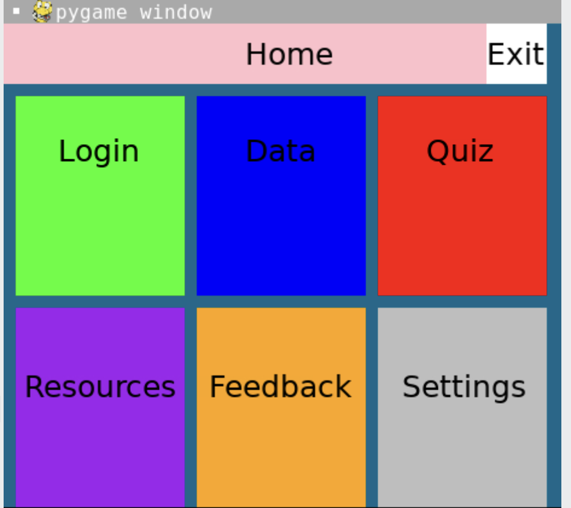
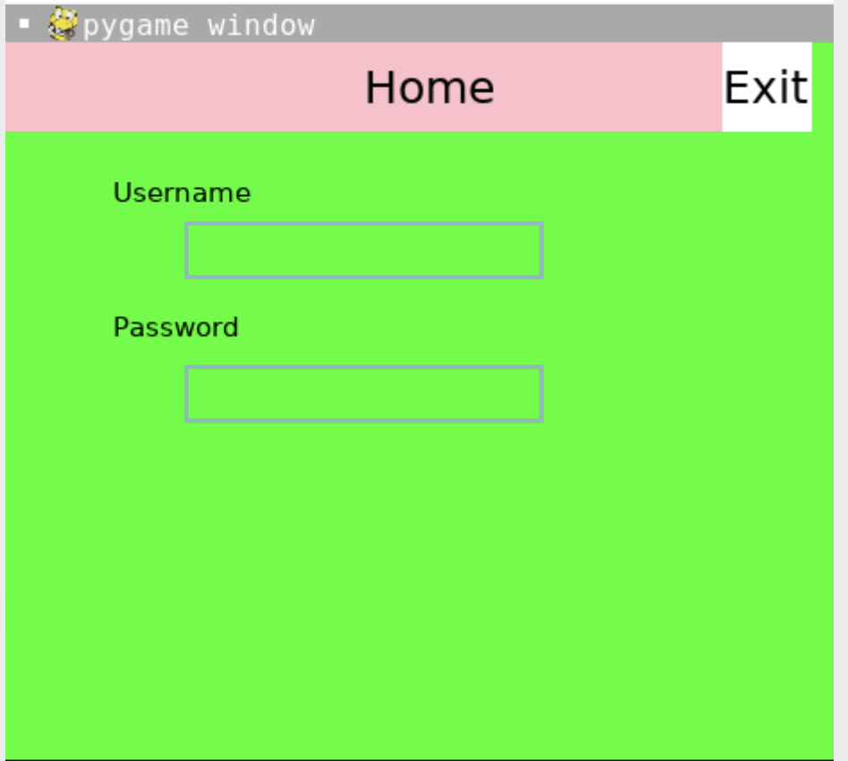
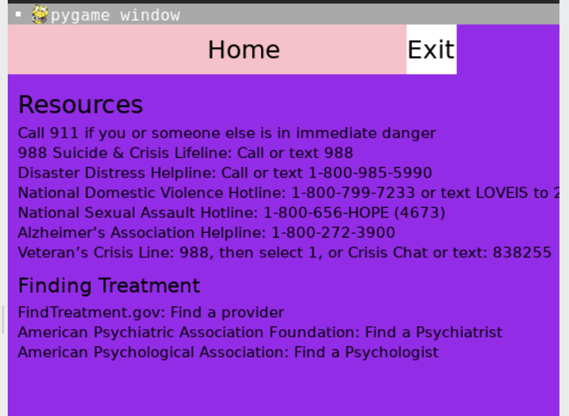
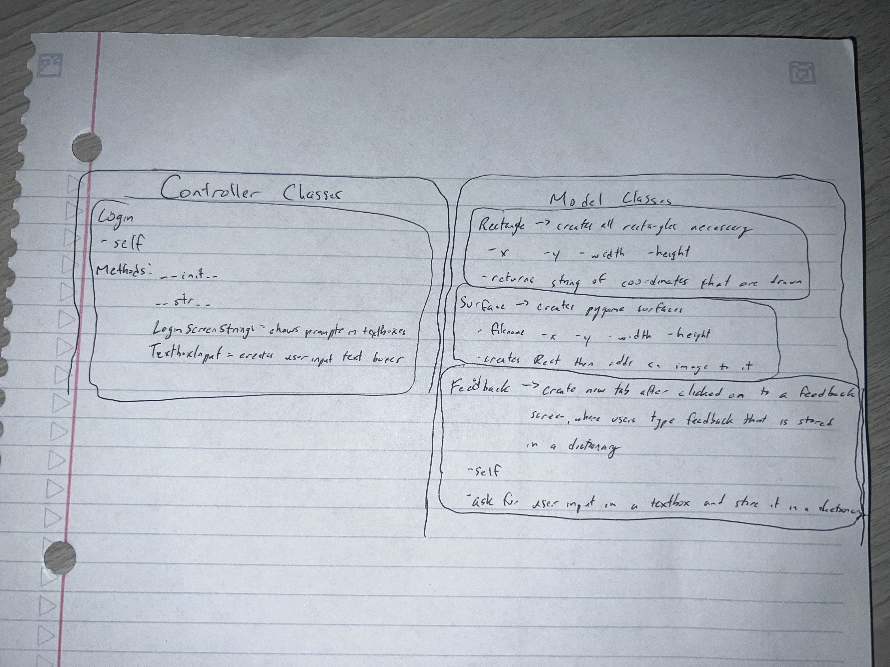

:warning: Everything between << >> needs to be replaced (remove << >> after replacing)
# CS110 Project Proposal
# << Project Title >>
## CS 110 Final Project
### Fall, 2022
### [Assignment Description](https://docs.google.com/document/d/1H4R6yLL7som1lglyXWZ04RvTp_RvRFCCBn6sqv-82ps/edit?usp=sharing)

https://replit.com/join/vroylsxtmg-nicholasgenoves

<< [link to demo presentation slides](#) >>

### Team: Team 5
#### Nicholas Genovese, Brianna Jules

***

## Project Description

<< Our project is meant to teach others about mental health and provide mental health resources. We have a quiz that keeps score and writes the previous scores on the data page to show progession. The settings allows the user to customize the background color. >>
***    

## User Interface Design

- **Initial Concept**
  - << A wireframe or drawing of the user interface concept along with a short description of the interface. You should have one for each screen in your program. For example, if your program has a start screen, game screen, and game over screen, you should include a wireframe / screenshot / drawing of each one and a short description of the components. >>
   IMG_0774 2.jpeg 
    
- **Final GUI**
  - <<>>
  - <<>>
  - <<>>
  - << >>
  - << >>
***        

## Program Design

* Non-Standard libraries
    *pygame is all we have right now. We plan to add more
    * << You should have a list of any additional libraries or modules used (pygame, request) beyond non-standard python. 
         For each additional module you should include
         - url for the module documentation
         - a short description of the module >>
* Class Interface Design
  * 
    * << A simple drawing that shows the class relationships in your code (see below for an example). This does not need to be overly detailed, but should show how your code fits into the Model/View/Controller paradigm. >>
        *  
* Classes
    * << You should have a list of each of your classes with a description. >>

## Project Structure and File List

The Project is broken down into the following file structure:

* main.py
* src
    * << all of your python files should go here >>
* assets
    * << all of your media, i.e. images, font files, etc, should go here) >>
* etc
    * << This is a catch all folder for things that are not part of your project, but you want to keep with your project >>

***

## Tasks and Responsibilities 

   * Outline the team member roles and who was responsible for each class/method, both individual and collaborative.

## Testing

* << Describe your testing strategy for your project. >>

## ATP

| Step                 |Procedure             |Expected Results                   |
|----------------------|:--------------------:|----------------------------------:|
|  1                   | Run Counter Program  |GUI window appears with count = 0  |
|  2                   | click count button   | display changes to count = 1      |
etc...
