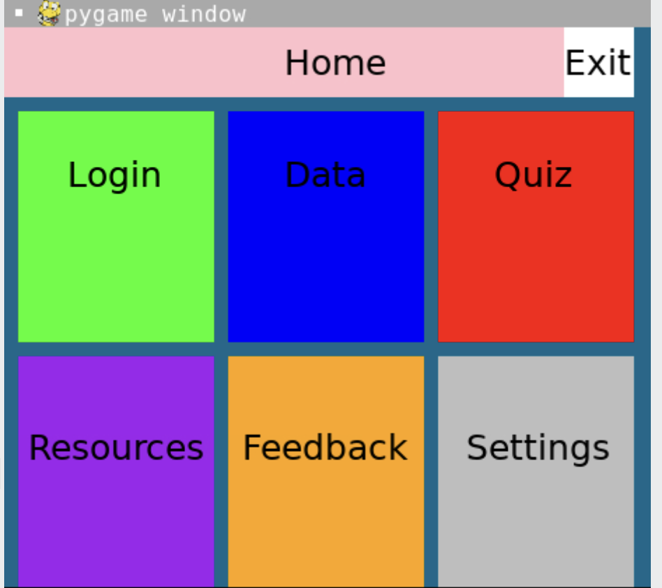
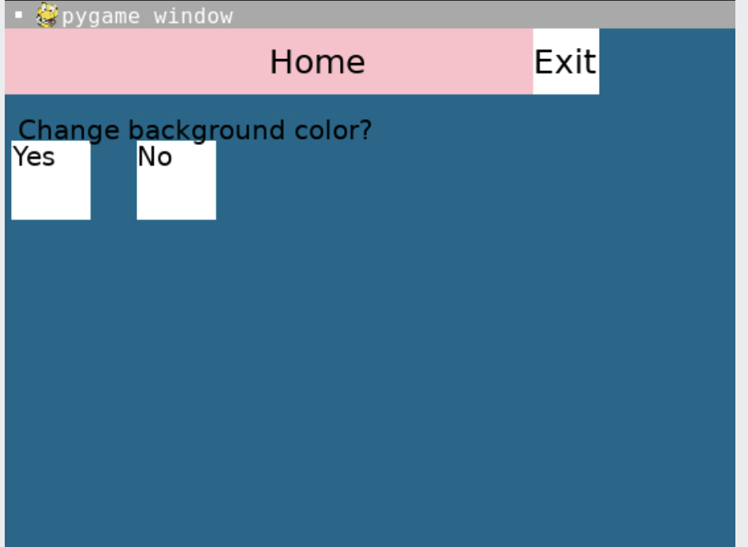
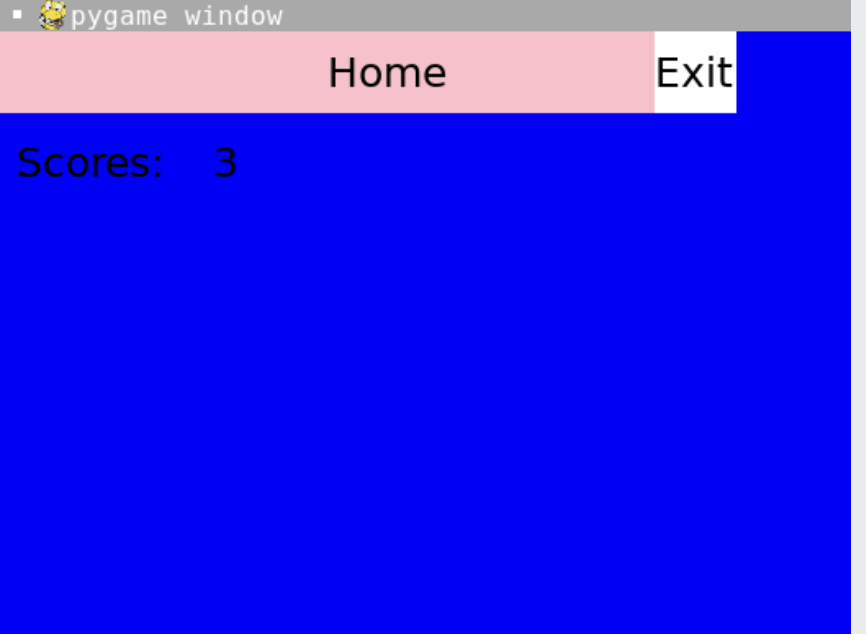
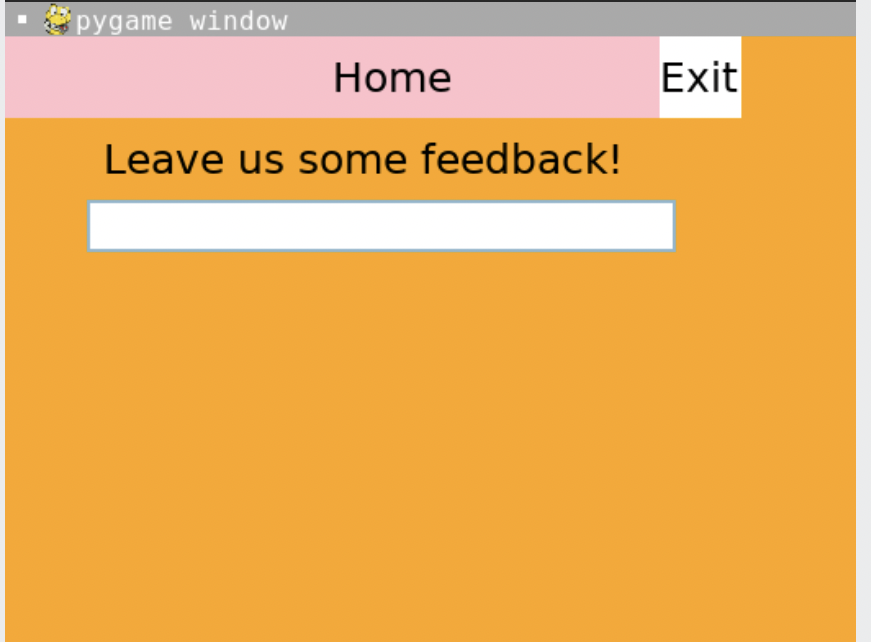
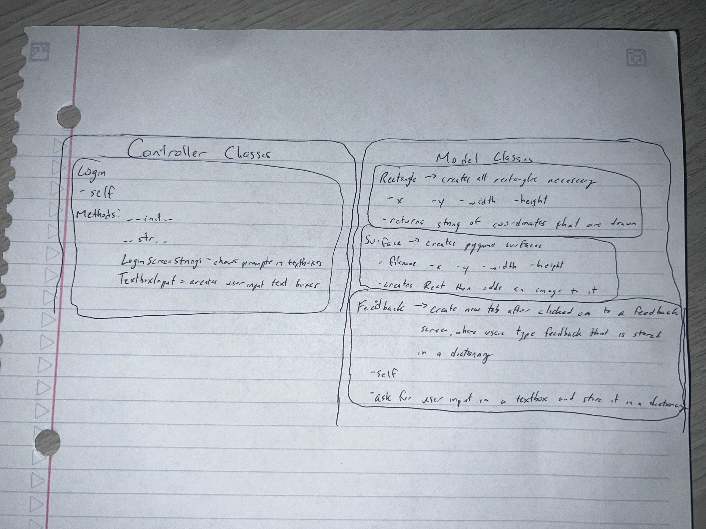

:warning: Everything between << >> needs to be replaced (remove << >> after replacing)
# CS110 Project Proposal
# bHealth
## CS 110 Final Project
### Fall, 2022
### [Assignment Description](https://docs.google.com/document/d/1H4R6yLL7som1lglyXWZ04RvTp_RvRFCCBn6sqv-82ps/edit?usp=sharing)

https://replit.com/join/vroylsxtmg-nicholasgenoves

[link to demo presentation slides](#)

### Team: Team 5
#### Nicholas Genovese, Brianna Jules

***

## Project Description

Our project is meant to teach others about mental health and provide mental health resources. We have a quiz that keeps score and writes the previous scores on the data page to show progession. The settings allows the user to customize the background color.
***    

## User Interface Design

- **Initial Concept**
  -  
   
    
- **Final GUI**
  - 
  - 
  - 
  -  
  - 
  - 
  - 
***        

## Program Design

* Non-Standard libraries
    * 
      Pygame module for drawing shapes. 
    * 
      This module provides access to some variables used or maintained by the interpreter and to functions that interact strongly with the interpreter. 
    * 
      This module provides various time-related functions. 
    * 
      This module implements pseudo-random number generators for various distributions.
    *
      A lightweight data interchange format inspired by JavaScript object literal syntax (although it is not a strict subset of JavaScript
* Class Interface Design
  * 
    * <<  >>
        
* Classes
    * InputBox
      * draws rectangles through pygame that allow the user to interact with them, type in them, and get an output
    * Label
      * draws labels for the quiz screen and button class specific to parameters
    * Button
      * used for the quiz screen, the button class creates 4 buttons with a dictionary of correct answers and refreshes the screen along with the score's increase

## Project Structure and File List

The Project is broken down into the following file structure:

* main.py
* src
    * all of your python files should go here
* assets
    * all of your media, i.e. images, font files, etc, should go here)
* etc
    * This is a catch all folder for things that are not part of your project, but you want to keep with your project 

***

## Tasks and Responsibilities 

   * the whole group worked together on everything

## Testing

* We created practice files that we used to run different screens with different functions individually. As we polished each screen, we began to put them together in another practice file. We continued to combine files and screens together until we were able to put everything into the controller at once.

## ATP

| Step                 |Procedure             |Expected Results                   |
|----------------------|:--------------------:|----------------------------------:|
|  1                   | Open terminal, enter python3 main.py  |Homescreen  |
|  2          | Click the login button | Brings user to login/user screen|
|  3          | Click the textboxes    |  User can type in textboxes a user/pass |
|  4          | Click the home button  | Returns user to homescreen        |
|  5          | Click the quiz button  | Brings user to the quiz screen    |
|  6          | Click the correct answers | Score will increase up to 3 maximum |
|  7          | Click the home button  | Returns user to homescreen        |
|  8          | Click the data button  | Brings user to data screen, quiz score will show up |
|  9         | Click the home button  | Returns user to homescreen         |
| 10      |Click the resource button| Brings user to resource screen|
| 11      |Click the feedback button| Brings user to feedback screen|
| 12      |Click the input button and fill in text | Print text on screen|
|  13          | Click the home button  | Returns user to homescreen        |
|  14          | Click the settings button  | Returns user to homescreen        |
|  15          | Click yes or no button  | Asks for color or prints on screen "Okay!"        |
| 16           | Click color if yes | Changes background color       |
| 17           | Click exit button | Exits program      |

